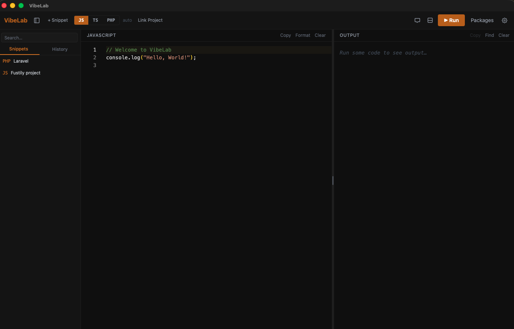

# VibeLab

> A local JavaScript / TypeScript / PHP scratchpad with a built-in AI assistant — no browser, no cloud, runs entirely on your machine.

**[vibelab.cybertroniankelvin.github.io](https://cybertroniankelvin.github.io/vibelab/)** · [Releases](https://github.com/CybertronianKelvin/vibelab/releases)



---

## Download

macOS only for now — grab the latest `.dmg` from the **[Releases page](https://github.com/CybertronianKelvin/vibelab/releases/latest)**. Windows and Linux builds will be added when available.

---

## Features

- **Monaco editor** — the same editor as VS Code, with syntax highlighting for JavaScript, TypeScript, PHP, and more
- **Live code execution** — run JS/TS directly, with streaming stdout/stderr to the output panel
- **AI chat panel** — ask questions about your code; supports Claude, OpenAI, Groq, and OpenRouter. The AI sees your editor code and your project's installed packages automatically
- **npm package manager** — install and remove packages without leaving the app
- **Project linking** — link any local project folder so the AI can read `package.json` or `composer.json` and give context-aware answers
- **Find in output** — VS Code-style Cmd/Ctrl+F search in the console panel
- **Copy buttons** — copy editor code or console output to clipboard in one click
- **Dark theme** — easy on the eyes, amber/orange accent colour

---

## Install

**Current builds: macOS only.** Windows and Linux installers will be added when available.

### macOS

1. Download the `.dmg` for your chip (arm64 = Apple Silicon M1/M2/M3, x64 = older Intel)
2. Open the DMG and drag **VibeLab** to `/Applications`
3. The app is currently unsigned, so macOS Gatekeeper will block it on first launch. Run this once in Terminal:

```bash
xattr -cr /Applications/VibeLab.app
```

Then double-click the app normally.

### Windows

Run the `.exe` installer. Windows SmartScreen may warn because the app is unsigned — click **More info → Run anyway**.

### Linux

```bash
# Debian / Ubuntu
sudo dpkg -i vibelab_*.deb

# AppImage (any distro)
chmod +x vibelab_*.AppImage
./vibelab_*.AppImage
```

---

## Uninstall

Open VibeLab and choose **Help → Uninstall VibeLab…** from the menu bar. A confirmation dialog will appear — click **Uninstall** and the app will close and remove all of its data (snippets database, settings, npm workspace, and all cache files) automatically. No Terminal required.

---

## Development

Requirements: [Rust](https://rustup.rs), [Node.js 18+](https://nodejs.org), and the [Tauri v2 prerequisites](https://tauri.app/start/prerequisites/).

```bash
git clone git@github.com:CybertronianKelvin/vibelab.git
cd vibelab
npm install
npm run tauri dev
```

### Run tests

```bash
npm test
```

### Build a release locally

```bash
npm run tauri build
# Output: src-tauri/target/release/bundle/
```

### Publish a new version

```bash
npm run release 0.2.0
```

This bumps the version in all config files, commits and tags, builds, and uploads the artifact to a new GitHub release. Run the same command on each platform to add more installers to the same release.

---

## Tech stack

| Layer | Technology |
|---|---|
| UI | React 18 · TypeScript · Tailwind CSS |
| Editor | Monaco Editor (local package) |
| Desktop shell | Tauri v2 |
| Backend | Rust · tokio · reqwest |
| State | Zustand |
| Build | Vite · Vitest |

---

## License

[MIT](LICENSE) © 2026 Cybertronian
